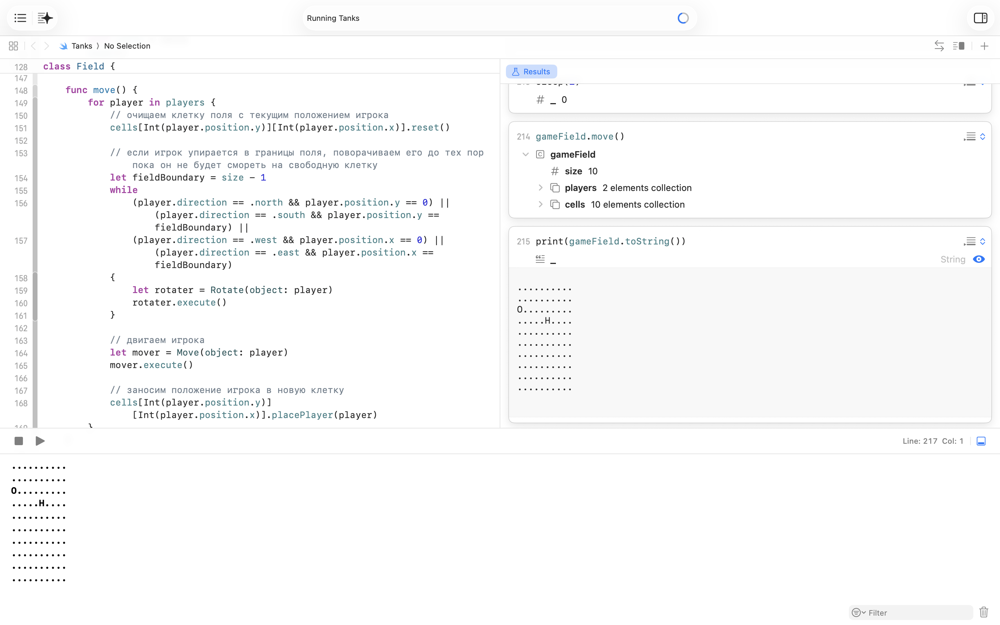
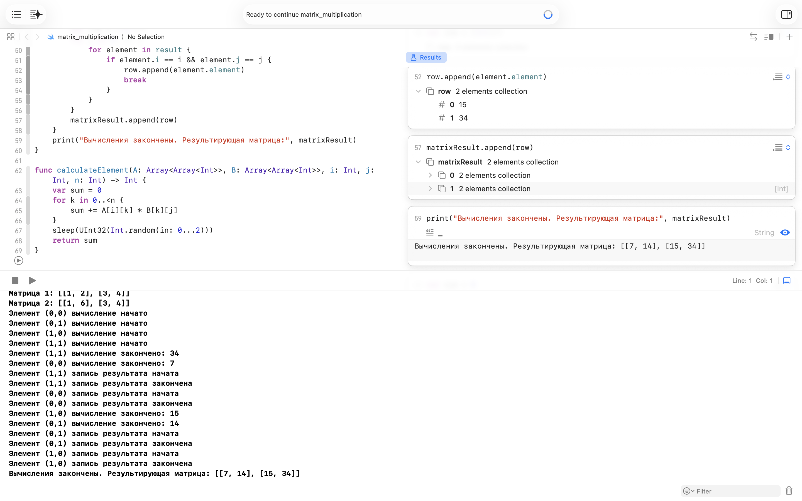
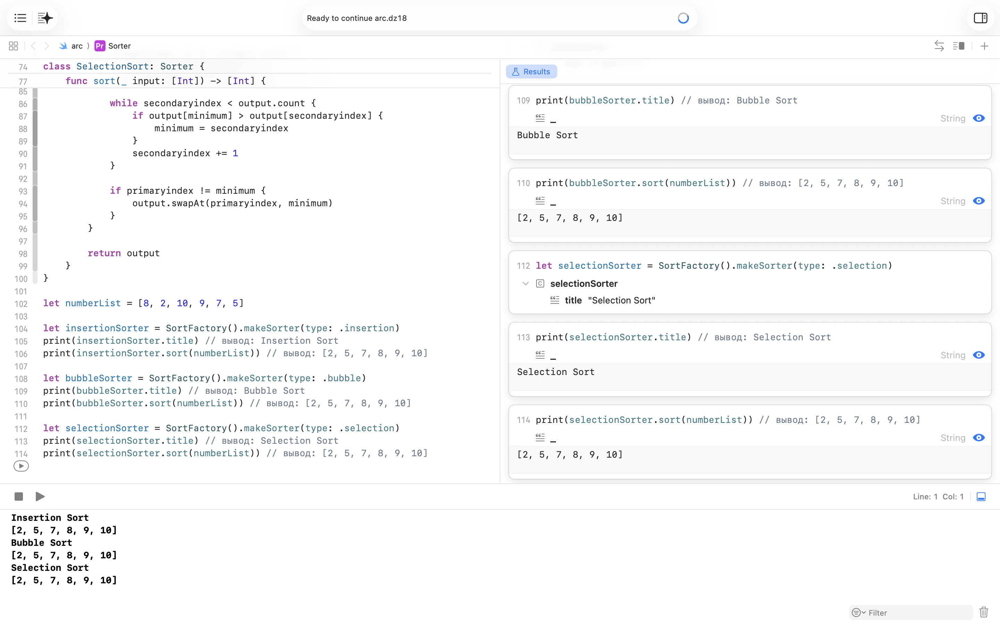
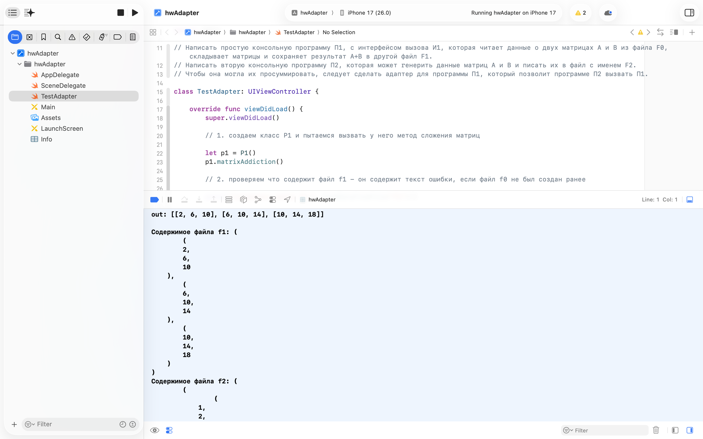
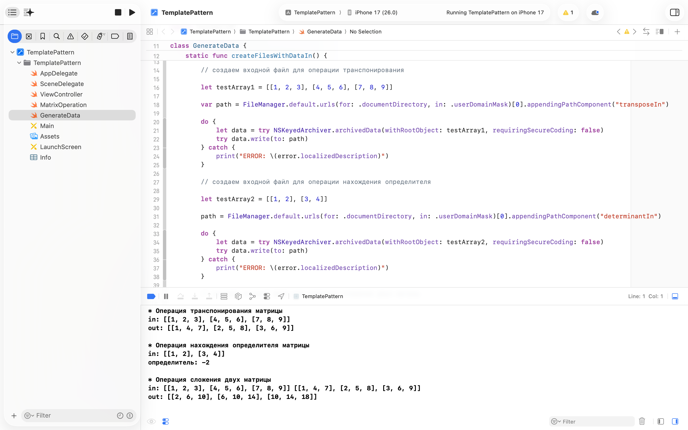
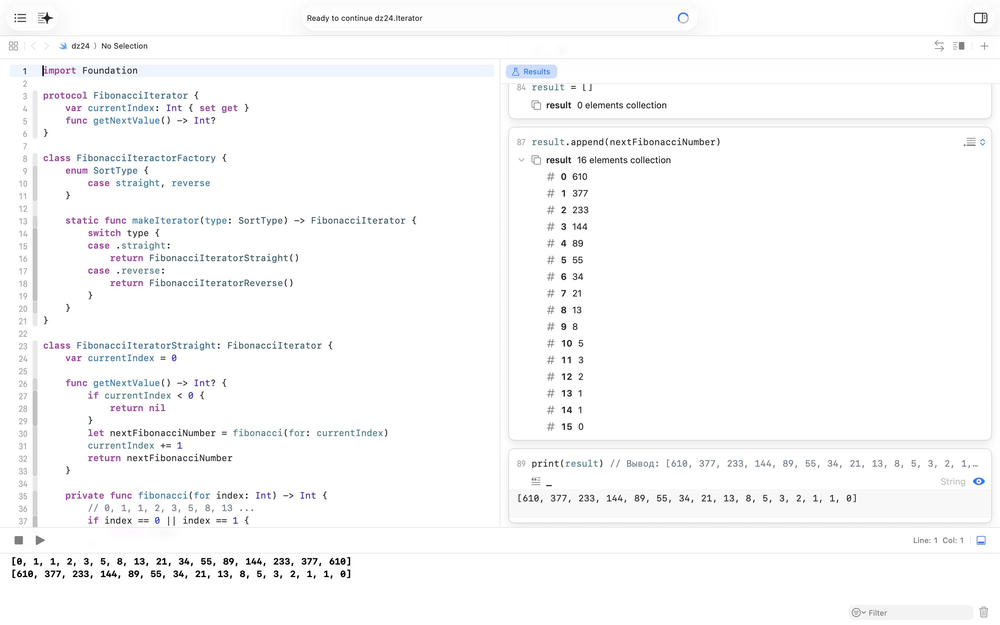
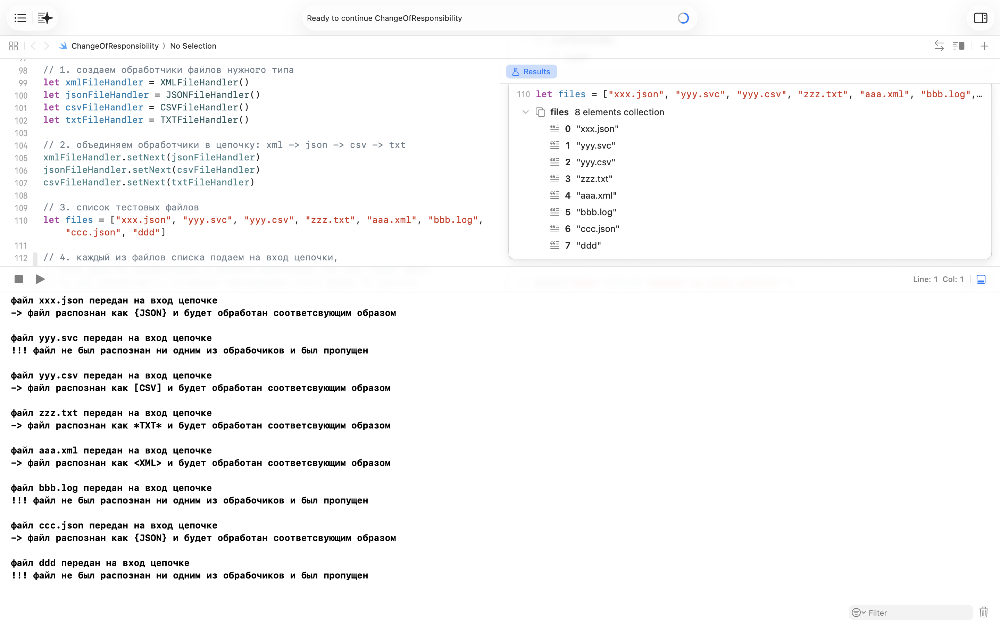
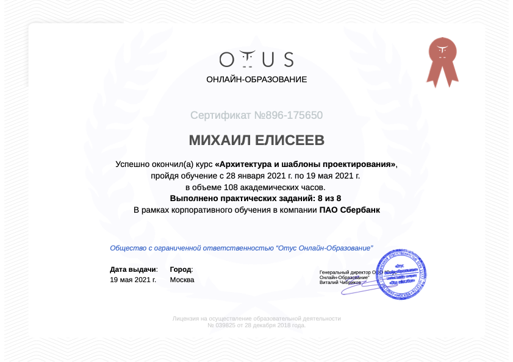

# 🏛️ Домашние задания к OTUS'овскому курсу «Архитектура и шаблоны проектирования»

Коллекция домашних работ к курсу OTUS [«Архитектура и шаблоны проектирования»](https://otus.ru/lessons/patterns/).

Изначально каждое ДЗ жило в отдельном GitHub-репозитории. Здесь они собраны в один архивный репозиторий.

- Язык решений: **Swift**.
- Формат решений: в основном **Swift Playground** и пара **iOS/Xcode-проектов**.

## Структура

```text
hw01-tanks/
hw04-matrix-multiplication/
hw18-factory/
hw19-adapter/
hw22-template-method/
hw24-iterator/
hw27-chain-of-responsibility/
docs/
  reports/
```

В папках `hwXX-*` сохранены исходные playground-и и Xcode-проекты.

## Домашние работы

|     | Работа | Паттерн / подход | Что отрабатывается | Краткое описание |
| --- | --- | --- | --- | --- |
| 1. | [`hw01-tanks`](hw01-tanks/) | Command | Объекты-команды, протоколы, композиция поведения | Мини-симуляция танков: движение и поворот вынесены в отдельные команды `Move` и `Rotate` с единым методом `execute()`. |
| 2. | [`hw04-matrix-multiplication`](hw04-matrix-multiplication/) | Data Parallelism / GCD | `DispatchQueue`, `DispatchGroup`, параллельные вычисления | Элементы результирующей матрицы вычисляются независимыми задачами на concurrent queue, а запись результата сериализуется отдельной очередью. |
| 3. | [`hw18-factory`](hw18-factory/) | Simple Factory / Factory Method | Фабрика объектов, протоколы, полиморфизм | `SortFactory` создаёт конкретные реализации сортировки за клиентский код: bubble, insertion и selection. |
| 4. | [`hw19-adapter`](hw19-adapter/) | Adapter | Совместимость интерфейсов, обёртка существующего класса, работа с файлами | Адаптер связывает генератор матриц `P2` с программой сложения `P1`, которая ожидает данные в другом файле. |
| 5. | [`hw22-template-method`](hw22-template-method/) | Template Method | Общий каркас алгоритма, наследование, матричные операции | Базовый класс матричной операции хранит общую инфраструктуру чтения/записи, а конкретные операции реализуют свою обработку. |
| 6. | [`hw24-iterator`](hw24-iterator/) | Iterator | Итератор, фабрика, последовательность Фибоначчи | Прямой и обратный обход последовательности Фибоначчи скрыт за общим интерфейсом итератора. |
| 7. | [`hw27-chain-of-responsibility`](hw27-chain-of-responsibility/) | Chain of Responsibility | Цепочка обработчиков, классификация файлов, fallback | Файл последовательно проходит через обработчики XML, JSON, CSV и TXT, пока один из них не распознает расширение. |

## Как запустить

Playground-работы можно открыть напрямую в Xcode:

```bash
open hw24-iterator/dz24.Iterator.playground
```

Для iOS/Xcode-проектов нужно открыть `.xcodeproj`:

```bash
open hw19-adapter/hwAdapter/hwAdapter.xcodeproj
open hw22-template-method/TemplatePattern/TemplatePattern.xcodeproj
```

## Обзор домашних работ

### 1. HW01. Паттерн Command: танки на поле

**Папка:** [`hw01-tanks`](hw01-tanks/)  
**Код:** [`Tanks.playground`](hw01-tanks/Tanks.playground/)  
**Паттерн / подход:** **Command** + композиция поведения через протоколы.

Мини-симуляция танков на квадратном поле. В коде есть сущности позиции, направления, клетки поля и игрока. Поведение разделено через протоколы `Visual`, `Movement` и `Rotatement`, а тип `Player` собирается как композиция этих возможностей.

Отдельные действия вынесены в классы `Move` и `Rotate`. Оба объекта получают цель, инкапсулируют конкретное действие и выполняют его через метод `execute()`. Это учебная реализация паттерна Command: действие превращается в объект, который можно создать, передать и выполнить отдельно от вызывающего кода.

**Комментарий:** работа показывает применение протоколов Swift и объектных команд: поле не двигает танк напрямую, а создаёт команду движения или поворота для объекта с нужным поведением.

#### Скрин запуска

<a href="docs/reports/report-1.png">
  
</a>

### 2. HW04. Параллельное умножение матриц на GCD

**Папка:** [`hw04-matrix-multiplication`](hw04-matrix-multiplication/)  
**Код:** [`matrix_multiplication.playground`](hw04-matrix-multiplication/matrix_multiplication.playground/)  
**Паттерн / подход:** **Data Parallelism** через GCD.

Работа посвящена умножению матриц с использованием `DispatchQueue` и `DispatchGroup`. Каждый элемент результирующей матрицы вычисляется отдельной async-задачей на concurrent queue, завершение задач отслеживается через `DispatchGroup`, а запись в общий массив результатов выполняется через отдельную serial queue.

Это не классический GoF-паттерн, а учебный пример конкурентного программирования на Swift/GCD: большая задача делится на независимые маленькие вычисления, они выполняются параллельно, а затем результат собирается после завершения группы задач.

**Комментарий:** работа полезна как демонстрация data parallelism. На маленькой матрице выигрыш производительности не важен; смысл работы — показать разбиение независимых вычислений на параллельные задачи и безопасную запись общего результата.

#### Скрин запуска

<a href="docs/reports/report-4.png">
  
</a>

### 3. HW18. Фабрика сортировщиков

**Папка:** [`hw18-factory`](hw18-factory/)  
**Код:** [`arc.dz18.playground`](hw18-factory/arc.dz18.playground/)  
**Паттерн / подход:** **Simple Factory** / учебный вариант **Factory Method**.

Реализован протокол `Sorter` и несколько конкретных сортировщиков: `BubbleSort`, `InsertionSort`, `SelectionSort`. Создание нужной реализации вынесено в `SortFactory`.

Клиентский код выбирает тип сортировки через enum и получает объект, работающий через общий интерфейс `Sorter`. Конкретный класс сортировщика скрыт за фабрикой.

**Комментарий:** по реализации это ближе к Simple Factory: фабрика централизованно выбирает и создаёт объект нужного типа. Идея та же учебная: клиент зависит от протокола, а не от конкретных классов сортировки.

#### Скрин запуска

<a href="docs/reports/report-18.png">
  
</a>

### 4. HW19. Adapter

**Папка:** [`hw19-adapter`](hw19-adapter/)  
**Код:** [`hwAdapter`](hw19-adapter/hwAdapter/)  
**Паттерн / подход:** **Adapter**.

Работа моделирует ситуацию с двумя программами. `P1` умеет складывать матрицы, читая входные данные из файла `f0` и записывая результат в `f1`. `P2` умеет генерировать данные, но пишет их в файл `f2`. Напрямую эти части не совместимы.

`P2ToP1ClassAdapter` оборачивает поведение `P2`: вызывает генерацию данных, затем копирует результат из `f2` в `f0`, приводя формат взаимодействия к ожиданиям `P1`.

**Комментарий:** это наглядный пример Adapter: вместо переписывания существующих классов добавляется прослойка, которая согласует несовместимые интерфейсы и точки интеграции.

#### Скрин запуска

<a href="docs/reports/report-19.png">
  
</a>

### 5. HW22. Template Method

**Папка:** [`hw22-template-method`](hw22-template-method/)  
**Код:** [`TemplatePattern`](hw22-template-method/TemplatePattern/)  
**Паттерн / подход:** **Template Method** в учебной форме.

Небольшой iOS/Xcode-проект с матричными операциями. Базовый класс `MatrixOperation` содержит общую инфраструктуру работы с файлами: загрузку входных данных и сохранение результата. Конкретные подклассы реализуют операции транспонирования, нахождения определителя и сложения матриц.

В классическом Template Method базовый класс обычно задаёт общий финальный алгоритм и вызывает переопределяемые шаги. Здесь реализация свободнее: общий базовый класс хранит повторяющуюся инфраструктуру, а конкретные операции переопределяют `doOperation(fileIn:fileOut:)`.

**Комментарий:** работа показывает смысл общего каркаса операции: повторяющаяся часть остаётся в базовом классе, а изменяемая логика выносится в специализированные реализации.

#### Скрин запуска

<a href="docs/reports/report-22.png">
  
</a>

### 6. HW24. Iterator

**Папка:** [`hw24-iterator`](hw24-iterator/)  
**Код:** [`dz24.Iterator.playground`](hw24-iterator/dz24.Iterator.playground/)  
**Паттерн / подход:** **Iterator** + простая фабрика итераторов.

Реализованы прямой и обратный итераторы по последовательности Фибоначчи. Итераторы создаются через `FibonacciIteractorFactory`, а клиентский код последовательно запрашивает следующее значение через `getNextValue()`.

Прямой итератор увеличивает индекс, обратный уменьшает его. Внешний код при этом работает с общим протоколом `FibonacciIterator` и не зависит от конкретной реализации обхода.

**Комментарий:** работа фиксирует идею Iterator: клиенту не нужно знать детали вычисления и направления обхода последовательности, он просто последовательно получает значения через общий интерфейс.

#### Скрин запуска

<a href="docs/reports/report-24.png">
  
</a>

### 7. HW27. Chain of Responsibility

**Папка:** [`hw27-chain-of-responsibility`](hw27-chain-of-responsibility/)  
**Код:** [`ChangeOfResponsibility.playground`](hw27-chain-of-responsibility/ChangeOfResponsibility.playground/)  
**Паттерн / подход:** **Chain of Responsibility**.

Реализована цепочка обработчиков файлов: XML, JSON, CSV и TXT. Каждый обработчик проверяет расширение файла; если файл ему не подходит, он передаёт обработку дальше по цепочке.

Цепочка собирается вручную: `xml -> json -> csv -> txt`. Если ни один обработчик не распознаёт файл, базовый обработчик выводит сообщение, что файл был пропущен.

**Комментарий:** работа показывает классический сценарий Chain of Responsibility: отправитель не знает, какой обработчик справится с запросом, а цепочка сама находит подходящий элемент или корректно доходит до fallback-а.

#### Скрин запуска

<a href="docs/reports/report-27.png">
  
</a>

## Сертификат

<a href="docs/otus.architecture.patterns.png">
  
</a>
